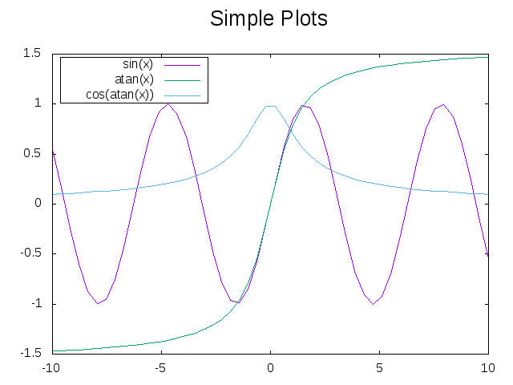

# md for testing

## some code quotes

Nothing runs - even in marked as `cmd`

```bash
ls .
```

```bash {cmd}
ls .
```

```bash {cmd=true}
ls .
```

```javascript {cmd="node"}
const date = Date.now()
console.log(date.toString())
```

```gnuplot {cmd=true output="html"}
set terminal svg
set title "Simple Plots" font ",20"
set key left box
set samples 50
set style data points

plot [-10:10] sin(x),atan(x),cos(atan(x))

```

## import bar chart

@import "images/barchart.svg"
@import "images/barchart.png"

## import pie chart

@import "images/piechart.svg"
@import "images/piechart.png"

## import sin

import svg
@import "images/sin.svg"

import png
@import "images/sin.png"

figure style


